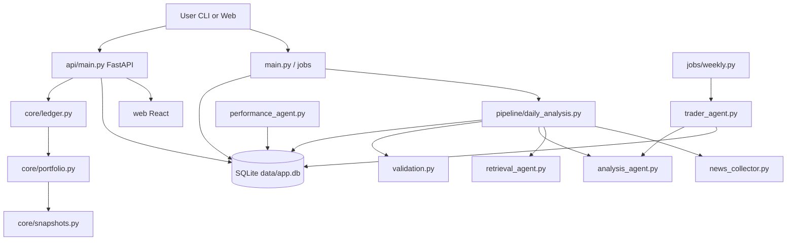

# Stock Trading Project Architecture

## Runtime sequence

1. **Daily:** Collect RSS → headline + upside retrieval → triage → shared context + three personas → validate tickers → `analysis_runs` table (+ optional JSON export).
2. **Weekly:** For each active portfolio, trader agent reads latest analysis + NAV/positions + rules → `weekly_plans` + `plan_items`.
3. **Human:** Review plan in UI; accept/reject items; log trades in Sofi; record via `POST /trades`.
4. **Insights:** `performance_agent` summarizes metrics and decisions.

## Persistence

- Default: `DATABASE_URL=sqlite:///./data/app.db`
- Docker: bind-mount `./data` (see `docker-compose.yml`)

## Staleness

`GET /plans/current` returns `staleness_banner`, `based_on_analysis_display`, and `is_stale` (>24h since analysis timestamp).
