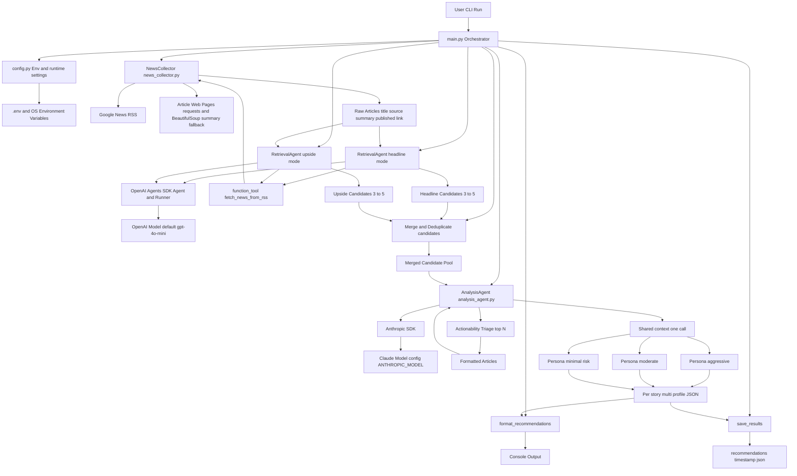

# Stock Trading Project Architecture

This diagram reflects the current implementation state of the project.

## Component Notes

- `main.py` is the orchestration layer and execution entrypoint (`asyncio.run(main())`).
- `config.py` centralizes model IDs, API keys, and operational limits (stories count, news age, RSS source).
- `news_collector.py` handles ingestion/parsing/filtering of Google News RSS entries and optional content fallback scraping.
- `retrieval_agent.py` now runs in two modes: `headline` (major market movers) and `upside` (non-front-page asymmetric opportunities), each returning 3-5 stories.
- `analysis_agent.py` triages merged candidates for actionability, then for each selected story: one shared factual `shared_context` call, then three persona briefs (`aggressive`, `moderate`, `minimal_risk`) with separate recommendations and `portfolio_actions`.
- Results are both human-readable (console) and machine-readable (`recommendations_*.json`).

## Runtime Sequence (Current)

1. Fetch recent general news (`NewsCollector.get_general_news`).
2. Run dual retrieval (`RetrievalAgent.select_top_stories` in `headline` and `upside` modes).
3. Merge and deduplicate candidate pools in `main.py`.
4. Triage candidates for actionability (`AnalysisAgent.select_actionable_stories`).
5. Analyze selected stories in depth (`AnalysisAgent.analyze_stories` -> `analyze_story_multi_profile`: shared context + three personas).
6. Print formatted recommendations.
7. Save JSON output file with timestamp.
